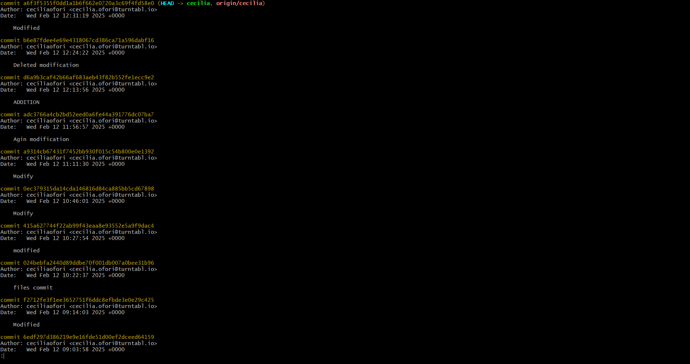
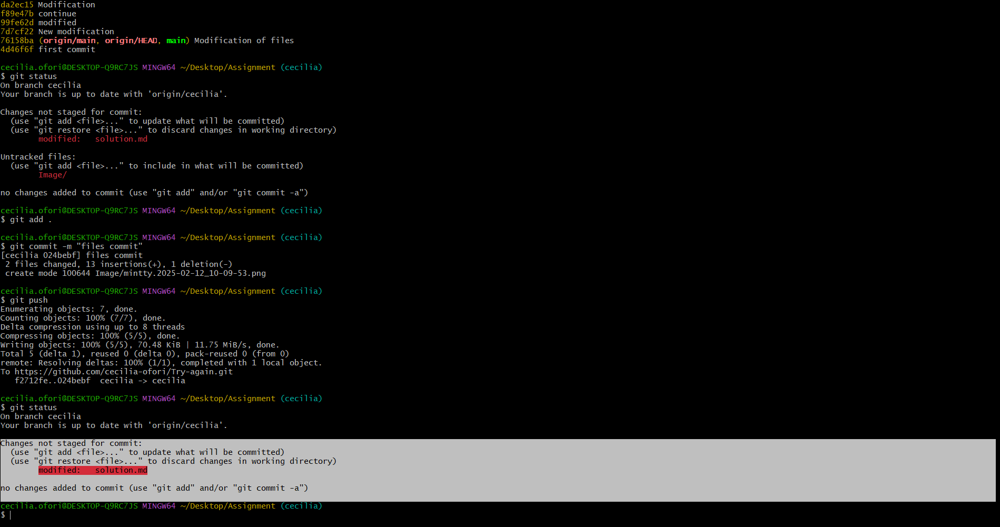
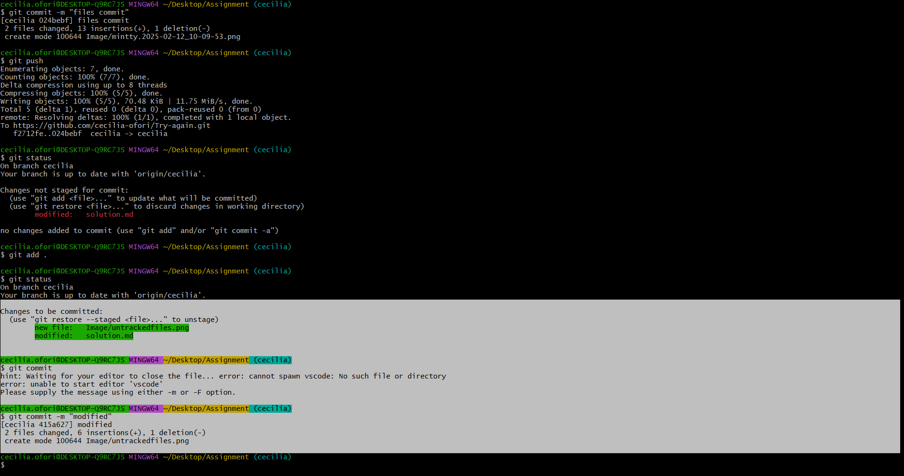
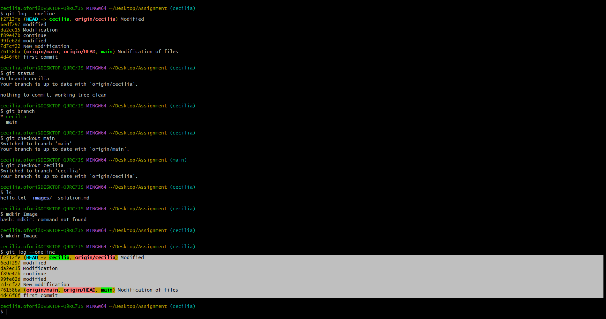
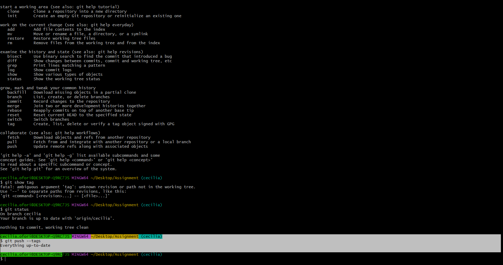
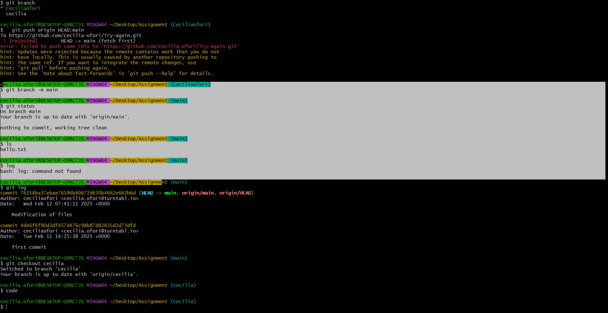

# Exercise 1

  .Git was created by Linus Torvalds, the same person who developed the Linux kernel.

The essence of Git lies in its ability to manage and track changes in source code (or other types of files) across time and collaboration,

 # Exercise 2

2. Git is a version control system (VCS) used to track changes in your code or files over time. It is a tool you run locally on your computer, managing your project’s history, commits, branches, merges, etc.
Key Functions:

Track changes to files.

Allow branching and merging for collaboration.

Manage project history.

Work both online and offline (locally).

git init:Initialize a new Git repository.

git commit:Record changes.

git push: Upload changes to a remote repository.

GitHub is a cloud-based platform that hosts Git repositories. It is the most widely used platform for storing and collaborating on Git repositories. It adds a lot of features for collaboration, such as pull requests, issues, actions, and more.

 Key Features: 

Remote Git hosting: You store your Git repositories online.

Collaboration tools: Issues, pull requests, comments, and more to help teams work together.

Public and private repositories: You can make repositories public or private.

Community and open-source: GitHub is a massive hub for open-source projects, and it supports social coding with stars, forks, and followers.

GitHub Actions: CI/CD pipelines to automate tasks like testing and deploying code.

Code reviews: You can easily collaborate on code changes through pull requests.

GitLab

GitLab is also a cloud-based platform for Git repositories, much like GitHub, but it offers more built-in DevOps tools, including continuous integration/continuous deployment (CI/CD) pipelines, issue tracking, and more.

# Exercise 2c
While Git is just a personal toolbox to manage your work on your own machine.

While GitHub is like a virtual office where you can share and collaborate with others online.

While GitLab is like a virtual office with extra automated tools, and you have the option to host it yourself if you need more control over your space.

# Exercise 3

3.Subversion (SVN)

 SVN is a centralized version control system (CVCS), meaning there is one central repository, and developers check out copies of the project from it to work on.

 Mercurial (Hg)

 Mercurial is another distributed version control system similar to Git. It is known for being easy to use and having a simpler learning curve than Git.

 Perforce (Helix Core)

Perforce, also known as Helix Core, is a centralized version control system designed to handle large-scale software development with large codebases (often used in game development, enterprise, and media industries).

   

# Exercise 4
   git status :

 It shows the current state of your working directory and staging area

# Exercise 5

Commit

A commit in Git is like taking a snapshot of your project at a certain point in time. It's a way to save your changes and keep track of them in your project's history

  # Exercise 6

  you can ignore files by creating a .gitignore file in your repository. This file tells Git which files or directories to exclude from version control, so they won't be tracked or committed. You can specify files, directories, or patterns to be ignored

  # Exercise 7

    # Exercise 7

    Git log command is used to display the commit history of a Git repository.
    
     It shows a list of commits, including details such as the commit hash, author, date, and commit message.

  
  # Exercise 8

    8 The command git add is used in Git to stage changes for the next commit. When you make changes to files in your working directory (such as editing, adding new files, or deleting files), those changes are not automatically tracked by Git until you stage them using git add.

# Exercise 9

    Staging area in Git is where you prepare your changes before committing them to the local repository. It allows you to carefully select which changes you want to include in your next commit.

# Exercise 10

  Exercise 10

# Exercise 11

    10 . To commit with meassage on the same line
    git commit -m "Your commit message here"

    1.  git push (Push Changes to Remote)
1.      git pull (Pull Changes from  Remote)
2.      git fetch (fetches  Changes from Remote)      

# Exercise 12

# Exercise 13
git merge: Merging Changes

git merge combines the histories of two branches, creating a new commit on the target branch (usually main or master) that links both branches together.

Rebase:

When you rebase a branch, Git moves or reapplies commits from one branch onto another, creating a linear commit history. Instead of creating a new merge commit, Git "re-applies" each commit from the source branch on top of the target branch.

.
# Exercise 14

 

 Yes, the git checkout command has an alias: 
git switch

git checkout <branch>:

This is used to switch to a different branch.

git switch <branch> (introduced as a more intuitive alternative):

This is specifically designed to switch between branches.

 
# Exercise 15

# Exercise 16

 

# Exercise 17

 

# Exercise 18

git pull is a command used in Git to fetch changes from a remote repository and merge them into your current local branch. It's a combination of two operations: 

fetch and merge

# Exercise 19
  

-d : Safe delete (only deletes if the branch is fully merged)

-D: Force delete (if the branch has unmerged changes)

 Exercise 20
 Still waiting for elvis